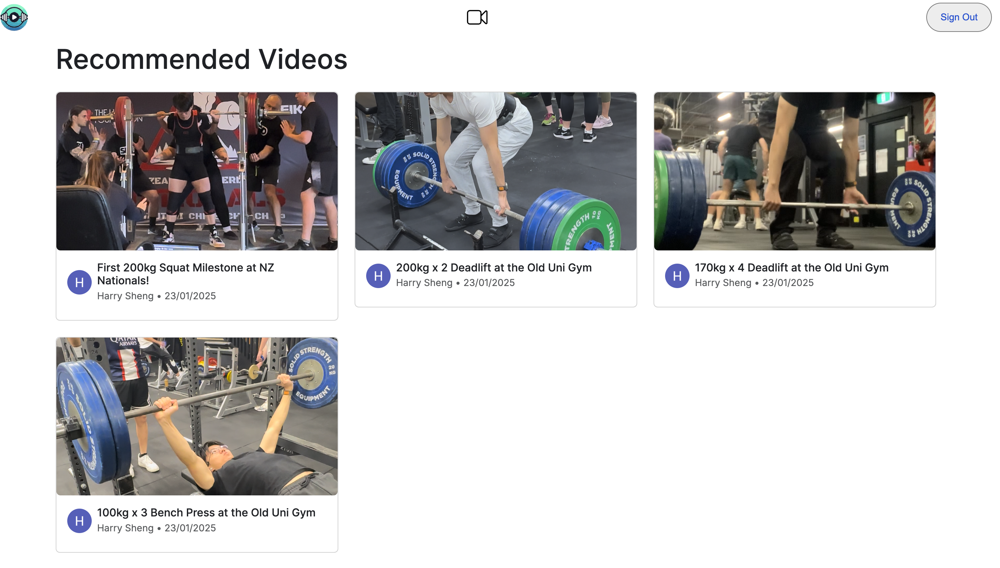
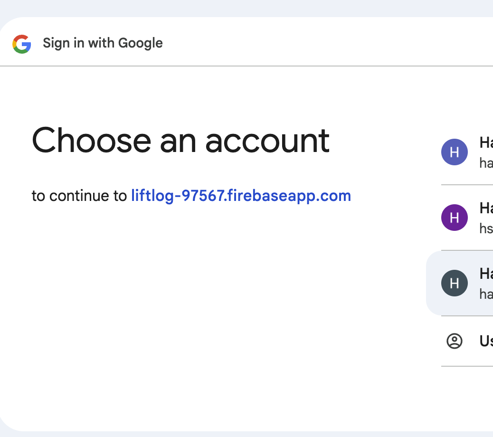

# LiftLog

Developed a platform where friends can share gym videos to track progress, set records, and motivate one another.

## Live Demo

https://liftlog-web-client-222314261215.australia-southeast1.run.app

## Table of Contents

1. [Features](#features)
2. [Technologies Used](#technologies-used)
3. [CodeBase Structure](#codebase-structure)
4. [Images](#images)

## Features

- User authentication through google sign-in
- User can upload a new video for their workout
- User can view all the videos uploaded by their friends
- Responsive design for mobile and desktop

## Technologies Used

- Frontend: React.js, Next.js, React-Bootstrap
- Backend: Express.js, Node.js
- Video Meta Database: Firestore (via Google Cloud)
- Storage: Google Cloud Buckets
- Authentication: Firebase Authentication
- Messaging & Event Handling: Google Cloud Pub/Sub
- Containerization & Deployment: Docker, Google Cloud Run

## CodeBase Structure

liftlog-api-service: Backend service for handling user creation, video uploads url, and video metadata storage related operations.

```
src
  index // contains functions for handling user creation, video uploads url, and video metadata storage related operations.
```

liftlog-web-client:

```
app
    firebase.ts // contains firebase configuration, and functions for google sign-in
    functions.ts // contains functions to call the backend api
    navbar // contains the navbar component
    upload // contains the upload component
    watch // contains the watch component
    layout.tsx // contains the layout of the app
    page.tsx // contains the home page
    components // contains the reusable components
```

liftlog-video-processing-sevice: Cloud Service for processing video uploads. It converts the video to 360p and stores the video in Google Cloud Storage.

```
src
    firestore.ts // contains functions for storing video metadata in Firestore
    index // contains function for processing video uploads, convert to 360p, and edit metadata in Firestore.
    storage.ts // contains functions for download/storing video in Google Cloud Storage, and converting video to 360p.
```

## images





